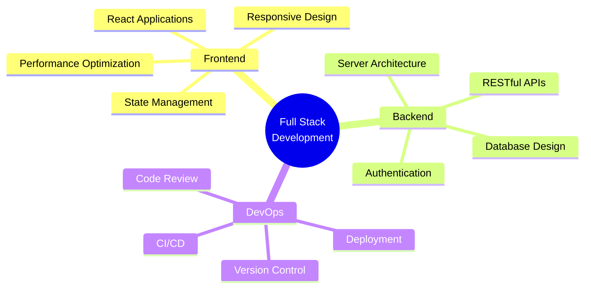

  
# 👋 Welcome to My Digital Workspace

  
  
  
  

---

## 🎯 Professional Summary

Passionate Full Stack Developer specializing in modern web technologies and scalable application architecture. With expertise across the complete development lifecycle, I transform complex requirements into elegant, efficient solutions. Currently focused on building high-performance applications using the MERN stack while continuously expanding my technical expertise.

<table align="center">
<tr>
<td width="50%" valign="top">

### 🚀 Current Focus
- Building enterprise-grade MERN applications
- Mastering advanced React patterns & optimization
- Exploring microservices architecture
- Contributing to open-source projects

</td>
<td width="50%" valign="top">

### 🎓 Learning Path
- System Design & Architecture
- Cloud Computing (AWS/Azure)
- DevOps & CI/CD Pipelines
- GraphQL & Advanced APIs

</td>
</tr>
</table>

---

## 💼 Technical Expertise

<b>🎨 Frontend Development</b>

 

| Category | Technologies |
|----------|-------------|
| **Frameworks** |   |
| **Languages** |     |
| **Styling** |   |

<b>⚙️ Backend Development</b>

 

| Category | Technologies |
|----------|-------------|
| **Runtime** |  |
| **Frameworks** |  |
| **Languages** |    |

<b>🗄️ Database & Cloud</b>

 

| Category | Technologies |
|----------|-------------|
| **Databases** |   |
| **Cloud/BaaS** |  |

<b>🛠️ Tools & Technologies</b>

 

| Category | Technologies |
|----------|-------------|
| **Version Control** |   |
| **Languages** |   |

---

## 📊 GitHub Performance Metrics

---

## 🏆 Achievements & Recognition

  

---

## 📈 Contribution Activity

  

---

## 🎯 Key Projects & Work

---

## 💡 Development Philosophy

<table>
<tr>
<td width="33%" align="center">

### 🎯 Clean Code
Writing maintainable, readable, and efficient code that stands the test of time

</td>
<td width="33%" align="center">

### 🔄 Continuous Learning
Staying current with emerging technologies and best practices

</td>
<td width="33%" align="center">

### 🤝 Collaboration
Building solutions through effective teamwork and communication

</td>
</tr>
</table>

---

## 📫 Let's Connect

### I'm always interested in collaborating on innovative projects!

  

  
  

 

*Open to exciting opportunities and challenging projects*

---

  
### ⭐ From [aniruddha1701](https://github.com/aniruddha1701)

